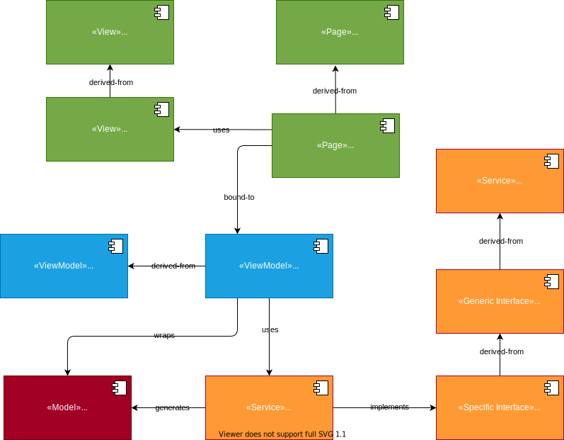

# Introduction
This repository contains a starting point for all your MAUI applications. 

The best way to use this is to open the solution in your visual studio, and export the project MauiAppSample as a "Visual Studio Template" (Project -> Export Template) after selecting the project.

# What does this sample do?
Well, the sample application is really very simple - it just shows up a button, which when clicked, throws up some numbers on a ListView that is just above the button. Everytime the button is clicked, some numbers are added to this ListView.

This button is simply labelled "Track Location" and the numbers that show up on the ListView are the latitude and longitude values of a location.

# Who can use this sample?
Everyone who develops mobile applications use [MAUI](https://dotnet.microsoft.com/en-us/apps/maui)

**AND**

Uses [Reactive Extensions](https://www.reactiveui.net/) (with all it's niceties such as Observables, Dynamic Data, etc.).

If either of these are **NOT** a target of your application's design, this sample is **NOT** for you.

The sample is heavily influenced by a superb sample in the ReactiveUI - [Cinephile](https://github.com/reactiveui/ReactiveUI.Samples/tree/main/Xamarin/Cinephile). Cinephile is done for Xamarin, while this sample is for MAUI.

# How to...
## ...Add a new page?

- Add both the XAML and the code-behind in the [Pages](MauiAppSample/Pages) folder. Make sure to derive your Page from [BasePage](MauiAppSample/Pages/BasePage.cs).
- Add a ViewModel for this page in the [ViewModels](MauiAppSample/ViewModels) folder, with properties and commands that you want to bind to in the page above. The ViewModel must be derived from [BaseViewModel](MauiAppSample/ViewModels/BaseViewModel.cs).
- Register the ViewModel for the Page in [AppBootstrapper.cs](MauiAppSample/AppBootstrapper.cs)
- Add code in the code-behind of your page to do the binding (see below) of properties and commands to the ViewModel

## ...Add a new custom-control or a ViewCell?

Follow the same steps as above, except:

- All views and their code-behinds should be in the [Views](MauiAppSample/Views) folder
- All views must be derived from either [BaseView](MauiAppSample/Views/BaseView.cs) (if top-level UI control) or [BaseViewCell](MauiAppSample/Views/BaseViewCell.cs) (if the view is for a single cell in the ListView, Table, etc.)

Other steps (registration of views and their view models, binding, etc.) follows the same steps as for Pages.

## ...Add a service?

- Add any data models your service will consume / generate in the [Models](MauiAppSample/Models) folder
- Create a base-service (as an abstract class or an interface) for the service in [Services/Base](MauiAppSample/Services/Base). Make sure to derive this from [BaseService](MauiAppSample/Services/BaseService.cs)
- Add a "mock" for the service so that you can test your service in [Services/Mock](MauiAppSample/Services/Mock). Make sure to derive this mock service from your own base-service interface / abstract class created above.
- Add the real implementation of the service directly in the [Services](MauiAppSample/Services) folder. Make sure to also derive this real service from your base service abstract class / interface created above
- Register your service in [AppConfig.cs](MauiAppSample/AppConfig.cs):
  - Use `RegisterConstant()` (in Splat) for registering your service (mock or real) as a singleton
  - Create a property to hold a global instance of your service
  - Assign your service instance to the above property using `GetService()` (in Splat)


# Architecture of the sample
The sample has a simple MVVM architecture as shown below. All the Views are coded in GREEN, ViewModels in LIGHT BLUE, and Models in BROWN. We additionally have "Services" that are coded in ORANGE. 



## Application bootstrapping

When the application [starts](MauiAppSample/App.xaml.cs), it [bootstraps](MauiAppSample/AppBootstrapper.cs) and then creates the [MainPage](MauiAppSample/Pages/MainPage.xaml).

Before creating the `MainPage`, it:

- Configures all services (i.e., registers a concrete implementation of a service with a service interface - using the [Splat](https://github.com/reactiveui/splat) dependency-injection framework)
- Registers ViewModels for all Views in the application (connecting pages to their view models and other custom-ui controls with their view models)

## Application Pages

The `MainPage` (and all other pages that are added to this application) derives from the [BasePage](MauiAppSample/Pages/BasePage.cs) so as to have a consistent feature access (such as logging, ViewModel associations, etc.) across all pages. As with any XAML application, `MainPage` comes with both [XAML](MauiAppSample/Pages/MainPage.xaml) and a [code-behind](MauiAppSample/Pages/MainPage.xaml.cs).Both the XAML and its code-behind form a part of the "View" in the MVVM pattern. For ease of discovery, all pages (although are also views) are placed under a dedicated folder [Pages](MauiAppSample/Pages).

## View Models

Each page has a corresponding ViewModel with a naming scheme `<PageName>ViewModel.cs`. All ViewModels are placed in the folder [ViewModel](MauiAppSample/ViewModels).The ViewModel corresponding to `MainPage` is [MainPageViewModel](MauiAppSample/ViewModels/MainPageViewModel.cs).

Similarly, a page may contain additional UI custom controls - just for keeping the [Pages](MauiAppSample/Pages) folder uncluttered, these are all added in the [Views](MauiAppSample/Views) folder. This `Views` folder too contains the custom-control's XAML file and its code-behind.

## View <-> ViewModel binding

The UI controls in the pages are bound to properties in the ViewModels, and this binding is done in the pages' code-behind. For custom-controls, this binding happens in the controls' code-behind file.

This binding uses simple Reactive Extension pattern. For example, the `MainPage` has this in the code-behind:

```
...
this.WhenActivated(disposable =>
{
  this.OneWayBind(ViewModel, vm => vm.LocationList, v => v.LstLocations.ItemsSource)
    .DisposeWith(disposable);

  this.BindCommand(ViewModel, vm => vm.StartReadingCommand, v => v.BtnStart)
    .DisposeWith(disposable);

  this.WhenAnyValue(vm => vm.ViewModel.StartReadingCommand)
    .Subscribe();
});
...
```
What you see is that specific properties in the ViewModel are bound to specific UI properties in the View using the Reactive Extensions `WhenActiviated`, `WhenAnyValue`, `OneWayBind`, and `BindCommand`. For editable UI controls, `Bind` can be used for two-way binds. 

While `OneWayBind` and `Bind` are for binding with properties, `BindCommand` is for binding UI control-actions to services that perform that action. You can see above that a button in the view is bound to an action to start reading from a sensor. So: 

***Views are bound to ViewModels using the Reactive Extensions in the View's code-behind.***

## Services and data Model

Services are those that generate data for (or consumes data from) ViewModels. This data that services generate or consume form the "Model" of MVVM.

There are various forms of services - those that perform a specific duty (for example, fetch weather information from a remote weather service - in this case the data Model that this service generates is the weather data), controls a car sensor (in this case, the service consumes control information from the ViewModel and uses that data to control a car-sensor).

In our case, the [MainPageViewModel](MauiAppSample/ViewModels/MainPageViewModel.cs) uses the [LocationSensor](MauiAppSample/Services/Base/LocationSensor.cs) service that generates [Location](MauiAppSample/Models/Location.cs) data (Model).

# Data Streams

The data generated from (or consumed by) the services are in the form of `IObservable<IChangeSet<T>>`, where `T` is the type of data Model generated (in our case, this `T` is `Location`).

When services generate `IObservable`, it is easy to respond to data on the UI because the ViewModel can simply `Subscribe` to this `Observable` and since ViewModels are also bound to the Views, the data generated by the services is simply reflected on the Views without any more intermediate code in the ViewModel.

Also, an `IObservable<IChangeSet<T>>` makes this even more interesting, as we now have all the [Dynamic Data](https://www.reactiveui.net/docs/handbook/collections/) operators at our disposal.

All operators of the Reactive Extensions [can be seen here](https://reactivex.io/documentation/operators.html). These operators help in transforming data, replacing data and many other interesting data operations easy.

# Concurrency 

To understand threading and concurrency issues that can crop up, go back to how Views, ViewModels and the Services that generate the Models work.

ViewModels basically are a link between Views and the Services that they offer to the Views. Typically, these services are either CPU-bound services (eg: calculations, data-crunching) or IO-bound (eg: reading sensor values, data transfers on network, etc.) This makes ViewModel's job tricky:

- One once side, Views need to respond to user-interactions almost real-time: when a UI control initiates an action to be performed by a service, it should not keep the application hanging until that action is complete (this will make the application unresponsive when a long-running service action is initiated)
- On the other side, Services typically access external systems (database systems, network systems or hardware) which may take time to respond to the service

So, basically, ViewModel will have to run different parts of the data stream at different speeds. Thankfully, Reactive Extensions come with a solution to exactly this problem: it makes use of schedulers.

ViewModels use this pattern for handling this (see this code in MainPageViewModel):

```
StartReadingCommand                           // <-- Running on a TaskpoolScheduler
  .SubscribeOn(RxApp.TaskpoolScheduler)       // <-- Running on a TaskpoolScheduler
  .ObserveOn(RxApp.TaskpoolScheduler)         // <-- Running on a TaskpoolScheduler 
  .Transform(x => new LocationViewModel(x))   // <-- Running on a TaskpoolScheduler
  .DisposeMany()                              // <-- Running on a TaskpoolScheduler
  .ObserveOn(RxApp.MainThreadScheduler)       // <-- Running on a TaskpoolScheduler
  .Bind(out _locationList)                    // <-- Running on the main (GUI) thread
  .Subscribe();                               // <-- Running on the main (GUI) thread
```

As you can see above, once the UI has initiated an action to read, the command kick-starts a service action that responds with an `IObservable<IChangeSet<T>>`. The actions run by ViewModel on the service (i.e., the action that `StartReadingCommand` initiates in the service `LocationSensor`) does not run in the main thread (which runs the GUI) - it runs from one of the threads in the thread-pool, so that the UI thread (main thread) is free to respond to any user-actions.

Howevever, once the data is generated by the service-thread, that data needs to be updated (i.e., bound to) a UI-element - and hence we use `.ObserveOn(RxApp.MainThreadScheduler)` to switch the context to the main-thread for data updation.

# Folders and files

The sample has the following folders and files (apart from the usual Visual Studio files):

Folder/File | Contents
----------- | ---------
[App.xaml](MauiAppSample/App.xaml) | Application front-end
[App.xaml.cs](MauiAppSample/App.xaml.cs) | Application front-end code-behind, our starting point
[AppBootstrapper.cs](MauiAppSample/AppBootstrapper.cs) | Bootstrapping code that initialises the logging system, and registers various services using the `AppConfig` (below). It also connects ViewModels a Views (registers an `IViewFor`)
[AppConfig.cs](MauiAppSample/AppConfig.cs) | Application configuration. It also "injects" a concrete implementation for services.
[Pages](MauiAppSample/Pages) | Folder that contains both the XAML and code-behind of all the application pages. All pages derive from the `BasePage` (below).
[Pages/BasePage.cs](MauiAppSample/Pages/BasePage.cs) | Base class for all application pages, that forces a template for using the logging system in all pages, and also connecting a page with its ViewModel
[Views](MauiAppSample/Views) | Folder containing custom-control's XAML and their code-behind.
[Views/BaseView.cs](MauiAppSample/Views/BaseView.cs) | All custom-control views derive from this, similar to the `BasePage`.
[Views/BaseViewCell.cs](MauiAppSample/Views/BaseViewCell.cs) | All ViewCells (eg: data template items inside a `ListView`, etc.) derive from this
[ViewModels](MauiAppSample/ViewModels) | Folder containing all the ViewModels of the Views and Pages. 
[ViewModels/BaseViewModel.cs](MauiAppSample/ViewModels/BaseViewModel.cs) | All ViewModels derive from this class
[Services](MauiAppSample/Services) | Folder containing all services. 
[Services/Mock](MauiAppSample/Services/Mock) | Since services can be complex, they also need an ability to "mock" by generating fake data during the development time. All such "mock" services go here.
[Services/Base](MauiAppSample/Services/Base) | All base-classes of individual services go here. Both the real service and the mock services derive from the base-service defined here.
[Services/BaseService.cs](MauiAppSample/Services/BaseService.cs) | All base-services (in the [Services/Base](MauiAppSample/Services/Base) folder) derive from this class. This enables logging for all services.

# Contact
If you liked this sample, or want to feedback, [contact me on twitter](https://twitter.com/arvindd).